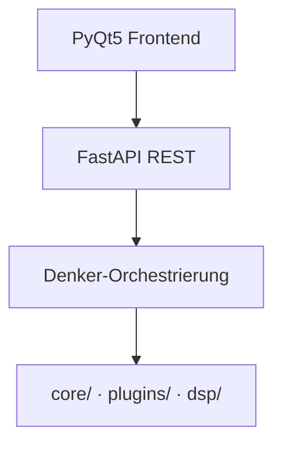

# Aurik 9 — Architekturdiagramm-Skill

Erzeugt hochdetaillierte Mermaid-Flowcharts der Aurik-9-Systemarchitektur.
Das Tool `renderMermaidDiagram` rendert das Ergebnis als hochauflösendes PNG.

## Wann verwenden
- „Zeig mir die Architektur von Aurik"
- „Erstelle ein Pipeline-Diagramm"
- „Mermaid-Übersicht der Kernmodule"
- „Wie hängen die ML-Plugins zusammen?"
- „Visualisiere die 14 Musical Goals im Prozess"

---

## Farbschema (verbindlich für alle Diagramme)

| Typ | `classDef` | Fill | Beschreibung |
|-----|-----------|------|--------------|
| ML-Modell / Plugin | `ml` | `#7B2FBE` (Lila) | Torch, ONNX, CLAP, MDX23C … |
| DSP-Algorithmus | `dsp` | `#1a6fcf` (Blau) | NumPy, SciPy, OMLSA, PGHI … |
| Qualitätsmetrik | `metric` | `#0f7a3e` (Grün) | MusicalGoals, PQS, NSIM … |
| Persistenz / Gedächtnis | `mem` | `#a05c10` (Braun) | ~/.aurik/ JSON-Dateien |
| Gating / Schutz | `gate` | `#c0392b` (Rot) | PMGG, Rollback-Mechanismen |
| Ein-/Ausgabe | `io` | `#2c3e50` (Dunkel) | Audio-Eingang, RestorationResult |

```mermaid
classDef ml   fill:#7B2FBE,color:#fff,stroke:#5a1f8b,stroke-width:2px
classDef dsp  fill:#1a6fcf,color:#fff,stroke:#0d4a8c,stroke-width:2px
classDef metric fill:#0f7a3e,color:#fff,stroke:#085e2e,stroke-width:2px
classDef mem  fill:#a05c10,color:#fff,stroke:#7a4508,stroke-width:2px
classDef gate fill:#c0392b,color:#fff,stroke:#96281b,stroke-width:2px
classDef io   fill:#2c3e50,color:#eee,stroke:#1a252f,stroke-width:3px
```

---

## Kanonische Pipeline-Reihenfolge §2.2

Für das vollständige Diagramm müssen die Module exakt in dieser Reihenfolge erscheinen:

```
① VORANALYSE
   TransientDecoupledProcessing (HPSS, §2.27)
   RestorabilityEstimator (DSP < 5s, §2.26)
   EraClassifier (CLAP + DSP-Rolloff, §2.14)
   GermanSchlagerClassifier (6-Schicht Zero-Shot, §2.19)
   MediumClassifier (17 Materialtypen, §2.1)

② DEFEKTANALYSE
   DefectScanner (24 DefectTypes, §6.3)
   CausalDefectReasoner (11 Kausalursachen, Bayes, §2.4)
   UncertaintyQuantifier (§2.15)

③ GP-OPTIMIERUNG & SCHUTZ
   GPParameterOptimizer (RBF-GP · UCB · MOO-Pareto, §2.5)
   HarmonicPreservationGuard (CREPE · G_floor=0.85, §2.28)
   PerceptualEmbedder (256-dim L2, §2.3)

→ PerPhaseMusicalGoalsGate wrapper (§2.29) — umhüllt alle Phasen

④ 56 RESTAURIERUNGS-PHASEN
   Tier 1: Defektkorrektur (Phase 01–30, inkl. Phase 56 HEAD_WEAR)
   Stem-Verarbeitung: MDX23C + VocalAI + StemRemixBalancer (§1.4)
   Tier 2: Instrument-Enhancement (Phase 42–52, PANNs-gesteuert)
   Tier 3: Studio Mastering (Phase 35–50)
   Tier 4: Export-Vorbereitung (Phase 40/47, Vocos wenn MOS < 4.3)

⑤ NACHBEARBEITUNG
   EraAuthenticPerceptualCompletion (DDSP, BW<10kHz, §2.35)
   IntroducedArtifactDetector (Retry×2 strength×0.5, §2.23)
   AdaptiveGoalThresholds + PhysicalCeilingEstimator (§2.31/§2.33)

⑥ QUALITÄTSBEWERTUNG & EXZELLENZ
   FeedbackChain (max 5 Iter, |ΔMOS|<0.02, §9.5)
   TemporalQualityCoherenceMetric (10s-Segmente, §2.16)
   PerceptualQualityScorer (Gammatone NSIM+MCD+LUFS+MOS, §2.6)
   ExcellenceOptimizer (MOO-Pareto, §2.5)
   GoalPriorityProtocol (Stufen 1–5, §2.34)
   MusicalGoalsChecker 14 Ziele (§1.2)
   EmotionalArcPreservationMetric (Arousal/Valence, §8.2)
   MicroDynamicsEnvelopeMorphing (400ms LUFS, ±3LU, §2.30)
```

---

## Vorgehen Schritt für Schritt

### 1. Scope klären
Frage den Nutzer (wenn kein Argument übergeben):
- **Vollständige Pipeline** (Standard): alle 6 Stufen
- **Einzelmodul-Fokus**: z.B. nur Musical Goals, nur Plugins, nur Denker
- **Vergleichsdiagramm**: Restoration-Modus vs. Studio 2026-Modus

### 2. Codebase inspizieren
Relevante Pfade für aktuelle Informationen:
```
core/                    # Kernmodule (Dateinamen = Modulnamen)
core/phases/             # 56 Phasen (phase_01_*.py … phase_56_*.py)
core/musical_goals/      # 14 Musical Goal Klassen
plugins/                 # ML-Plugins mit Fallback
denker/                  # Orchestrierungsschicht
backend/core/            # PMGG, FeedbackChain, ExcellenceOptimizer
models/manifest.json     # ML-Modell-Größen und Pfade
```

Schnelle Inspektion:
```python
list_dir("core/")          # Alle Kernmodule
list_dir("core/phases/")   # Alle Phase-Dateien
grep_search("class.*Metric", "core/musical_goals/")
grep_search("bundled_path|size_bytes", "models/manifest.json")
```

### 3. Diagramm erstellen

**Mermaid-Typ**: immer `flowchart TD` (top-down)

**Pflichten**:
- `classDef` immer am Anfang (Farbschema oben)
- Module in `subgraph`-Blöcken nach Stufen gruppieren
- Haupt-Datenfluss mit `-->` (solid)
- Gedächtnis/Plugin-Verbindungen mit `-.->` (gestrichelt)
- Retry-Loops mit `-.->|Label|` annotieren
- HTML-Entitäten für `<` und `>`: `&lt;` und `&gt;`
- Emojis für schnelle visuelle Orientierung (optional)

**Größenkontrolle**: Wenn Diagramm zu komplex → aufteilen in:
1. Pipeline-Übersicht (Blöcke ohne Detail)
2. Detail-Diagramm je Stufe

### 4. Rendern
```
renderMermaidDiagram(markup=..., title="Aurik 9 — ...")
```
Das Tool gibt die Mermaid-Syntax als Code-Block zurück (in VS Code als Preview sichtbar).

### 5. Qualitätsprüfung
Checkliste:
- [ ] Alle 6 Pipeline-Stufen vorhanden (bei Voll-Diagramm)
- [ ] Kanonische Reihenfolge eingehalten (§2.2)
- [ ] PMGG als roter Knoten sichtbar (es ist kritisch)
- [ ] 14 Musical Goals im Checker aufgelistet
- [ ] ML-Plugins als gestrichelte Verbindungen (nicht im Haupt-Flow)
- [ ] Persistenz-Schicht (~/.aurik/) als braune Knoten
- [ ] Farbschema korrekt (ml=Lila, dsp=Blau, metric=Grün)

---

## Teilvarianten

### Nur Musical Goals
```mermaid
flowchart LR
    classDef metric fill:#0f7a3e,color:#fff,stroke:#085e2e
    ... (14 Ziele mit Schwellwert, GoalPriorityProtocol Stufen 1–5)
```

### Nur Software-Schichten


### Nur ML-Plugins
Zeige alle Plugins aus `models/manifest.json` mit Größe, Fallback-Kaskade und Phasenzuordnung.

---

## Referenzen
- [copilot-instructions.md §2.2](../.github/copilot-instructions.md) — Pipeline-Ablauf
- [copilot-instructions.md §1.2](../.github/copilot-instructions.md) — 14 Musical Goals
- [copilot-instructions.md §4.4](../.github/copilot-instructions.md) — SOTA-Entscheidungsmatrix
- [models/manifest.json](../../models/manifest.json) — aktuelle ML-Modell-Größen
