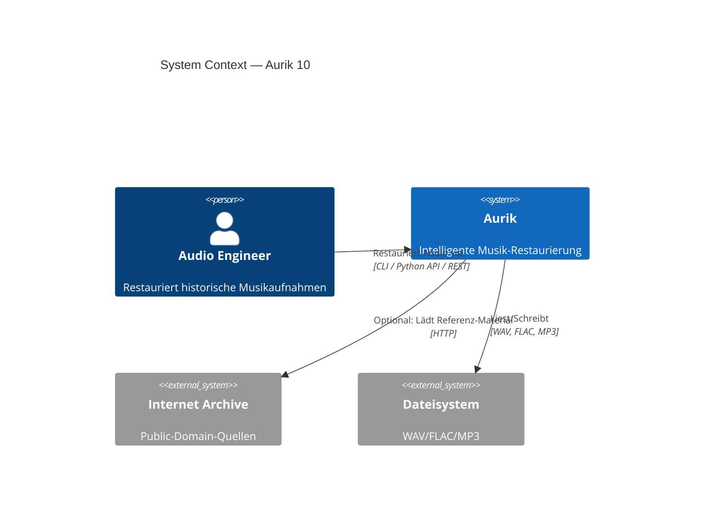
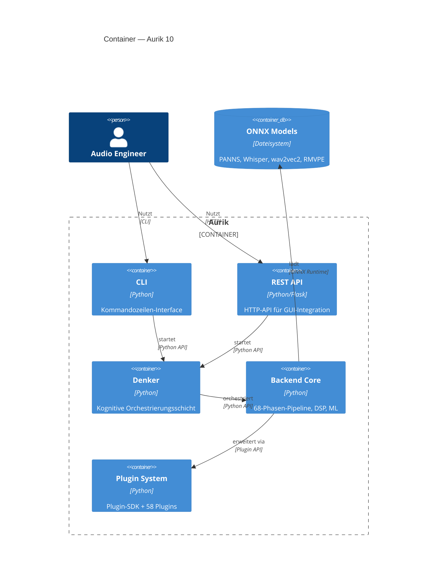
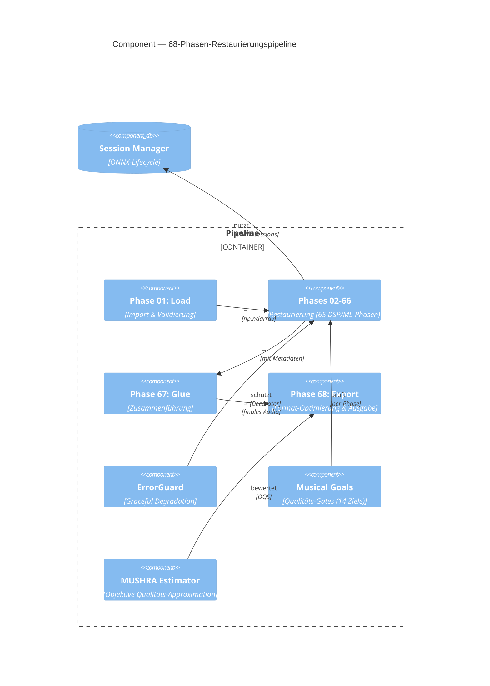

# Aurik Architektur

> §15.7: C4-Architekturdiagramme (Context, Container, Component).

## C4 Level 1: System Context

## C4 Level 2: Container

## C4 Level 3: Pipeline Component

## Schlüsselkonzepte

| Konzept | Beschreibung | Spec |
|---------|-------------|------|
| **Denker** | Kognitive Orchestrierung: Material-Erkennung → Pipeline-Auswahl → Phasen-Steuerung | §2.1 |
| **68-Phasen-Pipeline** | Sequenzielle Audio-Verarbeitung: Click Removal → Denoise → EQ → ... → Export | §2.2 |
| **Musical Goals** | 14 Qualitäts-Ziele (Timbral Fidelity, Artifact Freedom, ...) | §1.2 |
| **Bridge** | API-Schicht: Trennt Frontend von Backend Core (V01-Bypass-Verbot) | §8.1 |
| **ErrorGuard** | Graceful Degradation bei Phasenfehlern | §15.8 |
| **Plugin SDK** | ABC-basierte Plugin-Architektur für Drittentwickler | §15.6 |
