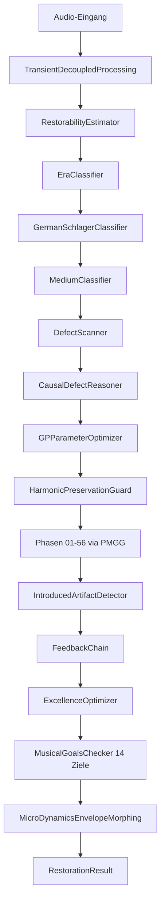

# Aurik 9.10.51 — Architektur-Überblick

**Stand:** März 2026  
**Status:** ✅ Produktionsbereit — 6312 Tests grün

---

## Zentrale Komponenten

| Komponente | Datei | Zweck |
|---|---|---|
| `UnifiedRestorerV3` | `core/unified_restorer_v3.py` | Haupt-Pipeline-Orchestrator |
| `DefectScanner` | `core/defect_scanner.py` | 27 DefectTypes, 15 Material-Priors |
| `CausalDefectReasoner` | `core/causal_defect_reasoner.py` | 14 Kausal-Ursachen (Bayes) |
| `GPParameterOptimizer` | `core/gp_parameter_optimizer.py` | RBF-GP + UCB, MOO-Pareto |
| `MusicalGoalsChecker` | `backend/core/musical_goals/musical_goals_metrics.py` | 14 Ziele |
| `MediumClassifier` | `core/medium_classifier.py` | 17 Materialtypen |
| `PerPhaseMusicalGoalsGate` | `core/per_phase_musical_goals_gate.py` | Rollback-Gate pro Phase |
| `AurikDenker` | `denker/aurik_denker.py` | Kognitive Orchestrierung |
| `MusikalischerGlobalplanDienst` | `backend/core/musikalischer_globalplan.py` | Cross-Phase-Globalplan, 13 Ära-Profile, 17 Phase-Adjustments (v9.10.50) |

## Datenfluss



## RestorationResult (normatives Ausgabeformat)

```python
@dataclass
class RestorationResult:
    # Pflichtfelder:
    audio:               np.ndarray
    config:              RestorationConfig
    material_type:       MaterialType
    defect_scores:       dict[DefectType, float]
    phases_executed:     list[str]
    phases_skipped:      list[str]
    total_time_seconds:  float
    rt_factor:           float
    quality_estimate:    float  # 0.40*(1-defect_sev) + 0.60*(pqs_mos-1)/4
    warnings:            list[str]
    metadata:            dict[str, Any]
    # Optionale Felder:
    pqs_result:          Optional[Any] = None
    musical_goals:       Optional[dict[str, float]] = None
    confidence:          float = 1.0
    era_decade:          Optional[int] = None
    # ... weitere Felder (harmonic_fingerprint, phase_gate_log, etc.)
```

## Musical Goals Prioritätsstufen

| Stufe | Goals | Verhalten bei Verfehlung |
|---|---|---|
| 1 (Unverhandelbar) | Natürlichkeit, Authentizität | Sofortiger Rollback |
| 2 (Kritisch) | TonalCenter, Timbre-Authentizität, Artikulation | Priorisiert in MOO |
| 3 (Wichtig) | Emotionalität, MicroDynamics, Groove | Nach Stufe 1+2 |
| 4 (Wertvoll) | Transparenz, Wärme, Bass-Kraft, SeparationFidelity | Kann entfallen |
| 5 (Best-effort) | Brillanz, SpatialDepth | Kein Misserfolg |

---

*Aurik 9.10.51 — März 2026*
