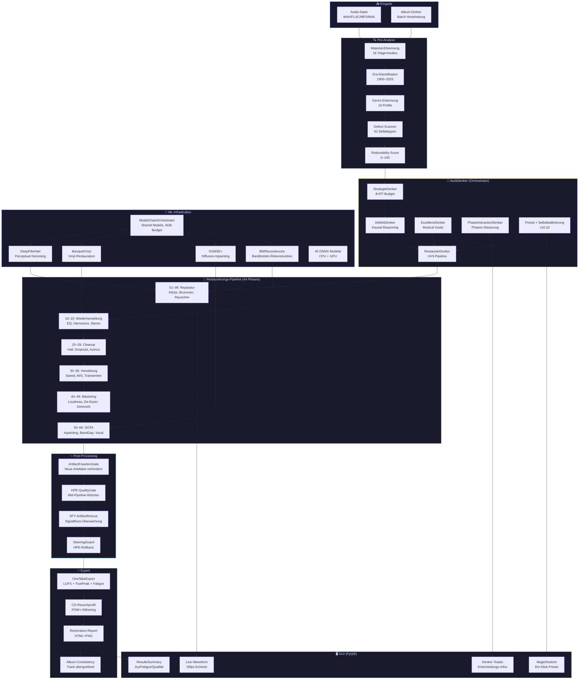

# Aurik 10.0.10 — Benutzerhandbuch

> **Version:** 10.0.10 | **Stand:** 19. Juli 2026 | **Sprache:** Deutsch

---

## 📑 Inhaltsverzeichnis

- [1. Was ist Aurik?](#1-was-ist-aurik)
- [2. Die zwei Modi](#2-die-zwei-modi)
  - [2.1 Restaurierung](#21-restaurierung)
  - [2.2 Studio 2026](#22-studio-2026)
- [3. Standard-Workflow](#3-standard-workflow)
  - [3.1 Datei importieren](#31-datei-importieren)
  - [3.2 Modus wählen](#32-modus-wählen)
  - [3.3 Verarbeitung starten](#33-verarbeitung-starten)
  - [3.4 Ergebnis prüfen](#34-ergebnis-prüfen)
- [4. Automatische Schutzmechanismen](#4-automatische-schutzmechanismen)
- [5. CD-Rauschprofil](#5-cd-rauschprofil)
- [6. Qualitätssicherung](#6-qualitätssicherung)
- [7. Export](#7-export)
- [8. Ergebnis und Transparenz](#8-ergebnis-und-transparenz)
- [9. Hinweise für Sonderfälle](#9-hinweise-für-sonderfälle)
- [10. FAQ](#10-faq)
- [11. Technische Referenz](#11-technische-referenz)
- [12. 🏗️ Aurik-Architektur — So funktioniert's](#12-aurik-architektur)


---

## 🏗️ Aurik-Architektur — So funktioniert's

> Alle Diagramme sind in **Mermaid** — kompatibel mit GitHub, VS Code, und jedem modernen Markdown-Viewer.

---

### 📐 Gesamtarchitektur



---

### 🔍 Pre-Analyse & Denker

```mermaid
graph LR
    subgraph SCAN["DefectScanner"]
        S1[Clicks/Pops] --> DM[DefectPhaseMapper]
        S2[Hiss/Noise] --> DM
        S3[Dropouts] --> DM
        S4[Wow/Flutter] --> DM
        S5[62 Typen...] --> DM
    end

    DM --> PD[PhaseInteractionDenker]

    subgraph DECIDE["Denker-Entscheidungen"]
        PD --> D1[Phase-Suppression<br/>unnötige Phasen skip]
        PD --> D2[Phase-Injection<br/>Material-kritisch erzwingen]
        PD --> D3[Order-Adaption<br/>Reihenfolge optimieren]
        PD --> D4[Strength-Budget<br/>pro Phase kalkulieren]
    end

    D1 --> PL[Phasen-Plan<br/>44 Phasen optimiert]
    D2 --> PL
    D3 --> PL
    D4 --> PL

    style SCAN fill:#1a1a2e,stroke:#82B89A
    style DECIDE fill:#1a1a2e,stroke:#C8A84B
```



---

### 🔧 Phasen-Pipeline (vereinfacht)

```mermaid
graph LR
    subgraph R["Reparatur (01–09)"]
        R1[01 Klicks] --> R2[03 Denoise<br/>OMLSA+IMCRA]
        R2 --> R3[07 Harmonics<br/>H2-Steering]
        R3 --> R4[09 Crackle<br/>RBME+Bayes]
    end
    subgraph W["Wiederherstellung (10–19)"]
        W1[12 Wow/Flutter<br/>pYIN+DTW]
        W1 --> W2[14 Phase-Correction]
        W2 --> W3[16 Final EQ]
        W3 --> W4[19 De-Esser<br/>ConsonantBoost]
    end
    subgraph C["Cleanup (20–29)"]
        C1[24 Dropout<br/>CQTdiff+NMF]
        C1 --> C2[25 Azimuth]
        C2 --> C3[29 Tape-Hiss<br/>QuietZone-Shield]
    end
    subgraph M["Mastering (40–49)"]
        M1[40 Loudness<br/>EBU R128]
        M1 --> M2[47 TruePeak<br/>-0.3 dBTP]
    end
    subgraph S["SOTA (50–66)"]
        S1[55 Inpainting<br/>FlowMatching]
        S1 --> S2[56 BandGap<br/>HEAD_WEAR]
        S2 --> S3[65 Vocal-Natürlichkeit]
    end

    R --> W --> C --> M --> S

    style R fill:#1a1a2e,stroke:#B87A7A
    style W fill:#1a1a2e,stroke:#C8A84B
    style C fill:#1a1a2e,stroke:#82B89A
    style M fill:#1a1a2e,stroke:#667eea
    style S fill:#1a1a2e,stroke:#7B93F0
```



---

### 🤖 ML-Infrastruktur

```mermaid
graph TB
    MCO[ModelChainOrchestrator<br/>Shared Instances, RAM-Budget 6GB]

    subgraph MODELS["45 ONNX-Modelle"]
        M1[DeepFilterNet<br/>250 MB, Perceptual NR]
        M2[BanquetVinyl<br/>92 MB, Vinyl-Specialized]
        M3[SGMSE+<br/>500 MB, Diffusion]
        M4[BWReconstructor<br/>5 MB, Bandwidth]
        M5[MelBandRoformer<br/>860 MB, Spectral]
        M6[Demucs/HDemucs<br/>300 MB, Stems]
        M7[RMVPE<br/>345 MB, Pitch]
        M8[BEATs<br/>345 MB, Semantic]
        M9[CLAP<br/>400 MB, Audio-Text]
        M10[...35 weitere Modelle]
    end

    WARMUP[ModelWarmUpPool<br/>5 Modelle parallel laden<br/>Cold-Start 5→0s]

    MRN[MRN-Plugins<br/>Shellac/Vinyl/Tape/Lacquer<br/>ML-Chains mit DSP-Fallback]

    MCO --> M1
    MCO --> M2
    MCO --> M3
    MCO --> M4
    MCO --> M5
    MCO --> M8
    MCO --> M9
    WARMUP --> MCO
    MCO --> MRN

    style MCO fill:#1a1a2e,stroke:#667eea,color:#d0dcff
    style MODELS fill:#1a1a2e,stroke:#7B93F0
    style WARMUP fill:#1a1a2e,stroke:#82B89A
```



---

### 🎯 Preset-Learning × Selbstkalibrierung (v10.10)

```mermaid
graph TB
    subgraph PRESET["Preset-Learning (statistisch)"]
        P1[Built-in Presets<br/>6 kuratierte Profile]
        P2[User-Presets<br/>lernend aus Ergebnissen]
        P3[Material/Ära/Genre<br/>Fuzzy-Matching]
        P4[learn_from_result()<br/>HPE + User-Rating]
    end

    subgraph SELF["Selbstkalibrierung (live)"]
        S1[HPE-Gate<br/>alle 8 Phasen prüfen]
        S2[Defekt-Profil<br/>→ Strength-Modulation]
        S3[Material-Floor<br/>Ceiling-Prüfung]
        S4[Recovery<br/>HPE stabil → zurück zu voller Strength]
    end

    subgraph MERGE["Synergie"]
        M1[Preset = Startpunkt]
        M2[Selbst = Feintuning ±15%]
        M3[Optimaler Arbeitspunkt<br/>Preset ∩ Selbst]
    end

    P1 --> M1
    P2 --> M1
    P3 --> M1
    P4 --> P2
    S1 --> M2
    S2 --> M2
    S3 --> M2
    S4 --> M2
    M1 --> M3
    M2 --> M3

    style PRESET fill:#1a1a2e,stroke:#C8A84B
    style SELF fill:#1a1a2e,stroke:#667eea
    style MERGE fill:#1a1a2e,stroke:#82B89A
```

---

### 🖥️ GUI-Kommunikation

```mermaid
graph LR
    subgraph BACKEND["Backend → GUI"]
        B1[Progress-Callback<br/>30fps Live-Status]
        B2[Denker-Toasts<br/>Phase-Suppression/Goals]
        B3[Waveform-Ring<br/>Live-Audio 30Hz]
        B4[ErrorSimplifier<br/>23 Fehler-Patterns]
        B5[Experience-Insights<br/>Joy/Fatigue/Empfehlungen]
    end

    subgraph UI["GUI-Widgets"]
        U1[ModernProgressBar<br/>mit Sub-Phasen-Balken]
        U2[_ToastNotification<br/>Floating oben-rechts]
        U3[Live-Waveform<br/>Echtzeit-Visualisierung]
        U4[QMessageBox<br/>Laien-verständlich]
        U5[ResultsSummary<br/>mit Emoji-Bewertung]
    end

    B1 --> U1
    B2 --> U2
    B3 --> U3
    B4 --> U4
    B5 --> U5

    style BACKEND fill:#1a1a2e,stroke:#667eea
    style UI fill:#1a1a2e,stroke:#82B89A
```



---

### 💾 Export-Pipeline

```mermaid
graph LR
    subgraph QUALITY["Qualitäts-Gates"]
        Q1[ArtifactFreedom<br/>≥ 0.95]
        Q2[HPE-Check<br/>Harmonic Preservation]
        Q3[Fatigue-Check<br/>Hörermüdung < 0.40]
    end

    subgraph EXPORT["OneTakeExport"]
        E1[LUFS-Normalisierung<br/>-16 Restoration / -12 Studio]
        E2[TruePeak-Limiter<br/>Ceiling -0.3 dBTP]
        E3[Adaptiver Fatigue-Cut<br/>-1/-2/-3 dB High-Shelf]
        E4[POW-r Dithering<br/>24→16 Bit]
    end

    subgraph OUTPUT["Ausgabe"]
        O1[WAV/FLAC 48kHz]
        O2[HTML-Report<br/>Phasen/Defekte/Joy]
        O3[Spektrogramm-PNGs<br/>pro Phase]
        O4[Album-Konsistenz<br/>Track-übergreifend]
    end

    Q1 --> Q2 --> Q3
    Q3 --> E1
    E1 --> E2 --> E3 --> E4
    E4 --> O1
    Q3 --> O2
    E1 --> O3
    O2 --> O4

    style QUALITY fill:#1a1a2e,stroke:#B87A7A
    style EXPORT fill:#1a1a2e,stroke:#667eea
    style OUTPUT fill:#1a1a2e,stroke:#82B89A
```



---

> **Legende:** 🟣 Input | 🟢 Analyse | 🟡 Denker | 🔴 Pipeline | 🔵 ML | 🔷 Post-Processing | 🟢 Export | 🟡 GUI

## 1. Was ist Aurik?

Aurik ist ein **intelligentes, vollautonomes Musik-Restaurierungssystem**.
Es erkennt selbstständig, welche Schäden eine alte Tonaufnahme hat,
und repariert sie — ohne dass der Benutzer Parameter einstellen muss.

Stell dir vor, du findest auf dem Dachboden eine alte Kiste mit Tonbändern.
Die Musik ist großartig, aber die Bänder rauschen, jaulen, haben Aussetzer
und dumpfe Höhen. Aurik hört sich den Song an, findet alle Probleme,
und repariert sie einzeln — so, dass die Musik am Ende klingt wie neu.

**Aurik arbeitet vollständig offline.** Kein Internet. Keine Cloud.
Nach der Installation läuft alles auf deinem Rechner.

---

## 2. Die zwei Modi

Aurik hat genau zwei Modi. Du wählst beim Import aus, was du erreichen willst:

### 2.1 Restaurierung

> *„So klingt das Original — nur ohne die Schäden."*

- **Bewahrt die Authentizität** der Aufnahme
- Entfernt Rauschen, Knistern, Knacksen, Gleichlauf-Schwankungen
- Stellt fehlende Frequenzen wieder her — aber nur, was physikalisch da war
- Erhält Atemgeräusche, Raumklang und den analogen Charakter
- **Original-Lautstärke bleibt erhalten**
- Fügt **CD-charakteristisches Rauschprofil** hinzu (nur wo hörbar)
- Geeignet für: **Tonbänder, Schallplatten, alte Kassetten, historische Aufnahmen**

### 2.2 Studio 2026

> *„Die Musik klingt, als wäre sie heute im Highend-Studio produziert."*

- **Moderner, brillanter Klang** mit kristallklaren Höhen
- Straffere Dynamik, wettbewerbsfähige Lautheit (−14 LUFS Streaming-Standard)
- **Breiteres Stereobild** für modernes Raumgefühl
- Sanfte Multiband-Kompression für druckvollen Sound
- Spektrale Reparatur für digitale Artefakte (MP3, Streaming)
- Entfernt störenden Raumhall für klare, direkte Stimmwiedergabe
- Ebenfalls mit **CD-charakteristischem Rauschprofil**
- Geeignet für: **Alles, was auf Spotify, YouTube oder Apple Music veröffentlicht werden soll**

---

## 3. Standard-Workflow

### 3.1 Datei importieren

1. Starte Aurik.
2. Klicke auf **„Datei öffnen"** oder ziehe eine Audiodatei in das Fenster.
3. Unterstützte Formate: **WAV, FLAC, MP3, AIFF, OGG, M4A**

### 3.2 Modus wählen

Nach dem Import erscheinen zwei große Buttons:

| Button | Modus | Wann? |
|--------|-------|-------|
| 🎵 **Restaurierung** | Authentizität bewahren | Alte Aufnahmen, Archivmaterial |
| 🎛 **Studio 2026** | Moderner Sound | Veröffentlichung auf Streaming-Plattformen |

Klicke auf den gewünschten Modus. **Das ist die einzige Entscheidung, die du treffen musst.**

### 3.3 Verarbeitung starten

Aurik beginnt sofort mit der Analyse und Verarbeitung:

```
🔍 Schritt 1/4: Fehleranalyse...
📋 Schritt 2/4: Phasen-Auswahl...
🔧 Schritt 3/4: Restaurierungspipeline...
📊 Schritt 4/4: Qualitätsbericht...
```

Die Verarbeitung läuft in **68 spezialisierten Phasen** — jede adressiert einen bestimmten
Defekttyp. Aurik entscheidet selbst, welche Phasen wie stark eingesetzt werden.

### 3.4 Ergebnis prüfen

Nach Abschluss siehst du das Ergebnis:

- ✅ **Verarbeitung abgeschlossen** — mit Qualitätsbewertung
- 💿 **CD-Rauschprofil** wurde angewendet
- 📊 **Qualitätsbericht** zeigt alle Scores (Harmonik, Transienten, Formanten, Artefakte)
- Die Datei liegt im `output/`-Ordner oder an dem von dir gewählten Speicherort

---

## 4. Automatische Schutzmechanismen

Aurik hat mehrere Schutzstufen, die **automatisch** eingreifen:

| Schutz | Was es tut |
|--------|-----------|
| **Artifact-Freedom-Gate** | Verhindert, dass die Restaurierung neue Störgeräusche erzeugt |
| **Vocal-No-Harm-Gate** | Schützt den Gesang vor Überbearbeitung |
| **Harmonic-Preservation-Guard** | Erhält die natürlichen Obertöne der Instrumente |
| **STCG (Stereo-Kohärenz)** | Verhindert Phasenverschiebungen zwischen linkem und rechtem Kanal |
| **Spectral-Tilt-Guard** | Stellt sicher, dass die Klangbalance (Bass/Mitten/Höhen) erhalten bleibt |
| **Passaggio-Schutz** | Reduziert Bearbeitung in den empfindlichen Übergangszonen der Stimme |

Wenn ein Schutz eingreift, wird das im Qualitätsbericht dokumentiert.
**Das ist kein Fehler — das ist Absicht.** Aurik opfert lieber ein bisschen Restaurierung,
als die Musik zu beschädigen.

---

## 5. CD-Rauschprofil

Ein besonderes Merkmal von Aurik: **Jede Restaurierung klingt am Ende wie eine CD.**

Nach der Reparatur aller Schäden fügt Aurik ein extrem leises, CD-charakteristisches
Rauschen hinzu. Dieses Rauschen ist so leise (−96 dB), dass du es nicht bewusst hörst —
aber dein Gehirn registriert es als „natürliche Stille".

Ohne dieses Rauschen würde die Musik in leisen Passagen „unheimlich still" klingen —
wie in einem schalldichten Raum. Mit dem CD-Rauschprofil klingt sie „richtig".

Das Rauschprofil wird **nur dort hinzugefügt, wo das Ohr es wahrnimmt** — in lauten
Passagen wird es von der Musik überdeckt und ist nicht vorhanden.

---

## 6. Qualitätssicherung

Nach jeder Restaurierung führt Aurik eine automatische Qualitätsprüfung durch:

| Metrik | Was sie misst |
|--------|--------------|
| **Harmonik-Erhaltung** | Sind die Obertöne der Instrumente noch intakt? |
| **Transienten-Erhaltung** | Sind die Anschläge (Schlagzeug, Klavier) noch knackig? |
| **Formanten-Erhaltung** | Klingt der Gesang noch wie der Sänger? |
| **Mikrodynamik** | Sind die feinen Lautstärkeschwankungen erhalten? |
| **Emotionaler Bogen** | Folgt die Spannungskurve noch dem Original? |
| **Artefakt-Freiheit** | Sind neue Störgeräusche entstanden? |

Jede Metrik liefert eine Note von 0–100. Der **Gesamtscore** fasst alles zusammen.
Aurik zeigt an, ob die Restaurierung **blindtest-tauglich** ist (Score ≥ 85).

---

## 7. Export

Nach der Verarbeitung wird die Datei automatisch exportiert:

- **Format:** WAV oder FLAC (verlustfrei)
- **Bittiefe:** 16 oder 24 Bit (konfigurierbar)
- **Abtastrate:** 48 kHz
- **Metadaten:** Enthalten Informationen über die durchgeführte Restaurierung

Der Export läuft über mehrere Stufen:

```
💿 CD-Rauschprofil → POW-r-Type-3-Dithering → Atomares Schreiben → Metadaten
```

---

## 8. Ergebnis und Transparenz

Die Verarbeitung liefert umfangreiche Informationen:

- Verwendeter Modus (Restaurierung / Studio 2026)
- Material-Typ (automatisch erkannt: Tonband, Vinyl, Kassette, etc.)
- Qualitäts-Scores (Harmonik, Transienten, Formanten, Artefakte)
- Ausgeführte Phasen (welche Reparaturen wurden durchgeführt)
- Gate-Entscheidungen (welche Schutzmechanismen haben eingegriffen)
- CD-Rauschprofil-Status

---

## 9. Hinweise für Sonderfälle

Wenn ein Ergebnis als `recovered` oder `degraded` markiert wird,
war ein Schutzgate aktiv. Das ist beabsichtigt und dient der
Vermeidung von Musikzerstörung.

- **Recovered:** Ein Schutz hat eingegriffen, die Restaurierung wurde
  mit reduzierter Intensität wiederholt. Das Ergebnis ist trotzdem gut.
- **Degraded:** Der ursprüngliche Zustand war zu schlecht für eine
  vollständige Restaurierung. Aurik hat das bestmögliche sichere
  Ergebnis exportiert.

---

## 10. FAQ

### Muss ich Parameter einstellen?

**Nein.** Aurik arbeitet vollautonom. Die einzige Entscheidung ist:
Restaurierung oder Studio 2026.

### Brauche ich Internet?

**Nein.** Nach der Installation arbeitet Aurik komplett offline.

### Kann ich mehr als zwei Kanäle verarbeiten?

Produktiv unterstützt sind **Mono und Stereo**. Surround-Formate
werden aktuell nicht unterstützt.

### Wie lange dauert eine Restaurierung?

Eine 5-Minuten-Aufnahme braucht etwa **3–5 Minuten** auf einem
modernen Rechner. Sehr lange Dateien (>10 Minuten) werden
speichereffizient in Blöcken verarbeitet.

### Kann ich das Ergebnis vor dem Export anhören?

**Ja.** Die Vorschau enthält bereits das CD-Rauschprofil —
sie klingt exakt wie der spätere Export.

### Werden meine Originaldateien verändert?

**Nein.** Aurik erstellt immer eine neue Datei. Das Original
bleibt unverändert.

---

## 11. Technische Referenz

| Kenngröße | Wert |
|-----------|------|
| Interne Abtastrate | 48.000 Hz |
| Pipeline-Phasen | 68 |
| Erkannte Defekttypen | 62 |
| Material-Typen | 16 |
| Qualitätsmetriken | 14 |
| CD-Rauschpegel (16-bit) | −96 dBFS |
| CD-Rauschpegel (24-bit) | −114 dBFS |
| Streaming-Lautheit (Studio 2026) | −14 LUFS |
| Archiv-Lautheit (Restaurierung) | −23 LUFS |

---

*Aurik 10.0.8 — Juli 2026*
